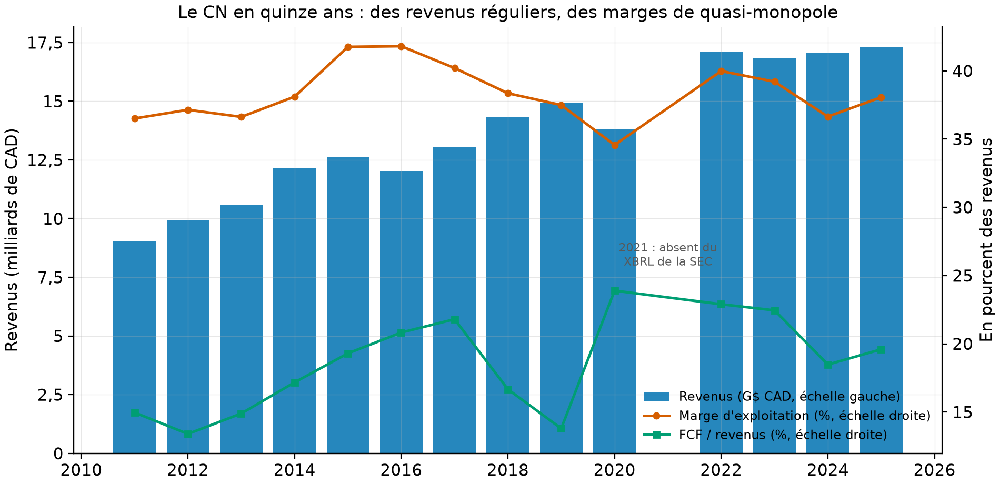
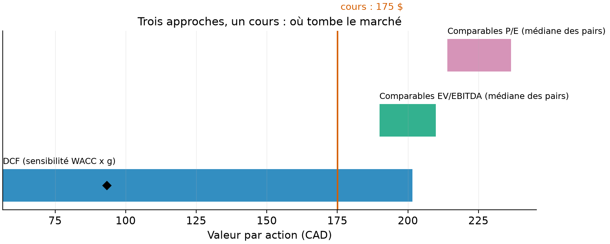
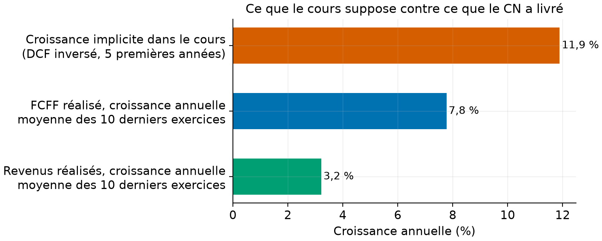

# Que vaut le Canadien National ? Trois réponses, et la croissance que le cours suppose

Une seule société, travaillée à fond : le Canadien National (CNR.TO), valorisé par trois méthodes
qui ne racontent pas la même histoire, avec chaque hypothèse statuée (mesuré, rapporté, précepte,
modélisé) et un classeur Excel aux formules vivantes pour tout refaire soi-même.

[](https://github.com/Guilou001/09-valuation-lab-ca/actions/workflows/ci.yml)


**Résultat en une phrase.** Au 28 août 2026 (cours 175,06 $), le DCF prudent, ancré sur la
croissance réalisée des revenus, dit **93 $** ; la médiane des multiples des pairs ferroviaires dit
**200 à 225 $**, le CN étant le moins cher de sa cohorte ; et le DCF inversé, la pièce maîtresse,
montre que **le cours suppose 11,9 % de croissance annuelle du flux disponible pendant cinq ans,
contre 7,8 % livré sur dix ans** : le mémo n'arbitre pas, il dit à quelles conditions chaque
lecture casse.

*English summary.* One TSX company end to end: Canadian National Railway, valued three ways with
every assumption statused. Financial history measured from SEC XBRL (companyfacts API, fiscal
2011-2025, the missing 2021 declared rather than filled); a prudent FCFF DCF anchored on delivered
revenue growth (C$93 per share at a 7.8 % WACC built from dated components); peer multiples
(median 16.6 × EBITDA, 29.8 × earnings, implying C$200-225, CN the cheapest of its cohort); and a
reverse DCF showing the C$175 price embeds 11.9 % annual FCFF growth for five years versus 7.8 %
delivered. Deliverables: four tables, three figures, a live-formula Excel workbook and a bilingual
investment memo that states what would break each reading.

## 1. La question posée

Que vaut une action du CN, et surtout : le chiffre qui sort d'un modèle dépend-il plus de
l'entreprise ou des hypothèses qu'on y met ? En mots simples : plutôt que d'annoncer un prix cible,
le dépôt retourne la question, quelle croissance faut-il croire pour justifier le cours
d'aujourd'hui, et est-elle plausible au vu de quinze ans d'histoire ?

## 2. D'où vient le projet, et ce qu'il apporte

La méthode est celle des manuels de valorisation (flux actualisés, comparables), le retournement
vient de la pratique : le DCF inversé, popularisé notamment par Mauboussin et Rappaport
(« Expectations Investing », 2001), lit le cours comme un réservoir d'attentes à confronter au
réalisé. Ce que ce dépôt apporte :

- **Des états financiers mesurés à la source** : l'API XBRL de la SEC (le CN est coté à New York),
  quinze exercices en dollars canadiens, sans ressaisie ; le trou de 2021, réel dans les données
  de la SEC, est déclaré au lieu d'être comblé.
- **Chaque hypothèse porte un statut** : le taux sans risque est rapporté de la Banque du Canada
  avec sa date, le taux d'impôt et le coût de la dette sont mesurés dans les comptes, la prime de
  risque est un précepte cité, et tout ce qui en découle est marqué modélisé.
- **La sensibilité est systématique** : 40 valeurs par action selon le WACC et la croissance
  perpétuelle, publiées telles quelles (de 56 $ à 202 $), pas un chiffre unique.
- **Un classeur Excel à formules vivantes** : la feuille DCF recalcule la valeur par action quand
  on change une hypothèse, comme dans une salle de marché, pas un export figé.

## 3. Les données

| Source | Contenu | Statut et accès |
|---|---|---|
| SEC, API companyfacts (CIK 16868) | 15 exercices en CAD : revenus, résultat d'exploitation, amortissements, flux d'exploitation, capex, intérêts, impôts, dette, trésorerie, actions diluées | mesuré ; `vlab fetch`, jamais commité |
| Yahoo Finance | cours, actions, bêta du CN ; multiples des pairs (CP, Union Pacific, CSX, Norfolk Southern) | rapporté, instantané daté du 2026-08-28 |
| Banque du Canada (Valet) | rendement de l'obligation 10 ans (3,70 % au 2026-08-27) | rapporté |

Deux trous déclarés : l'exercice 2021 du CN est absent du XBRL de la SEC (constaté sur
companyfacts ET sur l'API frames le 2026-08-28) et reste vide partout ; les concepts comptables
changent de nom en cours de route (revenus en 2018, intérêts en 2022), le chargeur suit des
chaînes de repli déclarées dans le code.

## 4. La méthode, pas à pas

1. **Reconstruire l'historique** : quinze exercices, puis les dérivés qui comptent : marge
   d'exploitation, FCF (flux d'exploitation moins capex), FCFF, le flux qui revient à l'ensemble
   des bailleurs, calculé flux d'exploitation + intérêts après impôt − capex, taux d'impôt
   effectif, bénéfice par action.
2. **Construire le WACC par composants statués** : taux sans risque 3,70 % (rapporté, BdC), prime
   de risque 5 % (précepte, Damodaran), bêta 1,00 (rapporté), coût de la dette 4,2 % et impôt
   20,6 % (mesurés) ; pondérés aux valeurs de marché, il ressort à 7,8 % (modélisé).
3. **Dérouler le DCF** : FCFF de départ 4 103 M$ (moyenne mesurée 2023-2025), croissance de 3,2 %
   pendant cinq ans (le rythme réalisé des revenus sur dix ans), fondu linéaire vers 2 % perpétuel
   (précepte : la cible d'inflation), dix ans de flux plus une valeur terminale de Gordon.
4. **Inverser le DCF** : chercher la croissance des cinq premières années qui rend la valeur par
   action égale au cours ; c'est la croissance que le marché fait payer.
5. **Comparer aux pairs** : médiane des multiples EV/EBITDA et P/E des quatre grands ferroviaires
   cotés, appliquée à l'EBITDA et au bénéfice du CN.
6. **Tout publier** : quatre tables, trois figures, le classeur, le mémo bilingue.

## 5. Les résultats : le cours vit entre le DCF prudent et les pairs (mesuré et modélisé)

Tous les chiffres viennent de `results/tables/` (`hypotheses.csv` liste chaque grandeur avec son
statut et sa source), régénérés par `uv run vlab build`.

| Approche | Valeur par action | Ce qu'elle suppose |
|---|---:|---|
| DCF, scénario prudent | 93 $ | croissance = revenus réalisés (3,2 %), WACC 7,8 % |
| DCF, sensibilité complète | 56 à 202 $ | WACC de 6 à 9,5 %, croissance perpétuelle de 1 à 3 % |
| Comparables EV/EBITDA | 200 $ | le CN payé comme la médiane des pairs (16,6 ×) |
| Comparables P/E | 225 $ | idem (29,8 ×) |
| Cours du 2026-08-28 | 175 $ | croissance implicite du FCFF : 11,9 % par an pendant 5 ans |

Comment lire ce tableau, en trois constats. D'abord, l'écart entre 93 $ et 225 $ ne dit pas que la
valorisation est arbitraire : chaque chiffre suppose autre chose, et la colonne de droite est la
vraie information. Ensuite, les deux lectures opposées coexistent sans contradiction : le CN est le
MOINS cher de sa cohorte (14,0 fois l'EBITDA contre 16,6 de médiane) tout en cotant au-dessus de
son DCF prudent ; si toute la cohorte embarque des attentes exigeantes, les deux sont vraies en
même temps. Enfin, le juge de paix est la croissance : 11,9 % implicite contre 7,8 % livré en
FCFF (dont une part venue de l'expansion des marges, qui ne se répète pas à l'infini) et 3,2 % en
revenus ; l'écart entre ces trois barres est exactement ce que l'acheteur d'aujourd'hui parie.



Comment lire cette figure : les barres sont les revenus (échelle de gauche, milliards de CAD), les
deux lignes se lisent à droite en pourcent des revenus ; la marge d'exploitation (vermillon) reste
entre 34 et 42 % sur quinze ans, un niveau de quasi-monopole, et la conversion en trésorerie
disponible (vert) oscille entre 13 et 24 %. L'exercice 2021, absent du XBRL de la SEC, est laissé
vide et annoté.



Comment lire cette figure : chaque barre horizontale est la fourchette d'une méthode, le losange
noir le scénario prudent du DCF, le trait vermillon le cours ; le cours tombe au-dessus de toute la
moitié basse du DCF et sous les deux fourchettes de comparables, la position exacte qu'un titre de
qualité au prix exigeant occupe d'habitude.



Comment lire cette figure : la barre du haut est la croissance annuelle du FCFF que le cours actuel
suppose pendant cinq ans (DCF inversé), les deux autres ce que le CN a réellement livré sur dix
ans ; l'acheteur à 175 $ parie que l'avenir fera mieux que le passé de 4 points par an.

Le mémo d'investissement bilingue, avec le tableau « la thèse casse si », est dans
[reports/memo_investissement.md](reports/memo_investissement.md) ; le classeur à formules vivantes
dans [reports/classeur_valorisation_cn.xlsx](reports/classeur_valorisation_cn.xlsx).

## 6. Reproduire

```bash
uv sync --locked --all-extras     # environnement verrouillé (Python 3.12, pandas 3, openpyxl)
uv run pytest                     # 8 tests : actualisation à la main, DCF inversé, Gordon, chargeur (sans réseau)
uv run vlab fetch                 # SEC companyfacts + instantané Yahoo daté + taux 10 ans BdC
uv run vlab build                 # 4 tables, 3 figures, classeur Excel, chiffres du mémo (quelques secondes)
```

## 7. Limites, avec leur statut

| Limite | Statut |
|---|---|
| L'exercice 2021 est absent du XBRL de la SEC (companyfacts et frames) ; laissé vide, croissances comptées par étiquettes d'années | constaté le 2026-08-28, déclaré |
| Le FCFF part du flux d'exploitation comptable (qui contient déjà la variation du besoin en fonds de roulement) plus intérêts après impôt moins capex : une approximation standard, pas une reconstruction poste à poste | déclaré |
| Le bêta est celui de Yahoo (5 ans, mensuel, contre indice américain) pour une action en CAD | rapporté, limite reconnue |
| Les multiples des pairs sont un instantané Yahoo d'un jour, pas des consensus lissés ; pas de prime de contrôle ni d'ajustements comptables fins | rapporté, daté |
| Un seul scénario de base ; les scénarios alternatifs vivent dans la grille de sensibilité et le classeur modifiable, pas en récits séparés | choix déclaré |
| Pas de LBO : hors périmètre (fiche du projet) ; pas de somme des parties | déclaré |

## 8. Crédits, licence, citation

Données : SEC EDGAR (API companyfacts, domaine public), Yahoo Finance (usage personnel, non
redistribué), Banque du Canada (Valet, licence ouverte). Méthode : Mauboussin, M. et Rappaport, A.
(2001), « Expectations Investing » ; Damodaran, A. (données de primes de risque). Code : Guillaume
Vaudescal, 2026, licence MIT. Ce dépôt est un exercice d'analyse, pas un conseil en placement.
